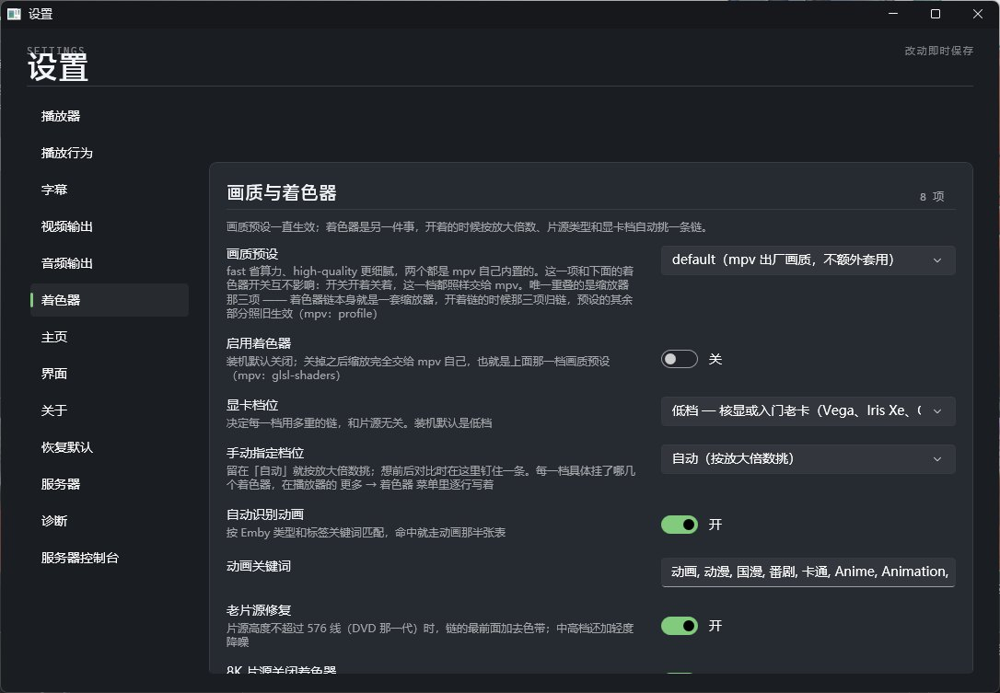
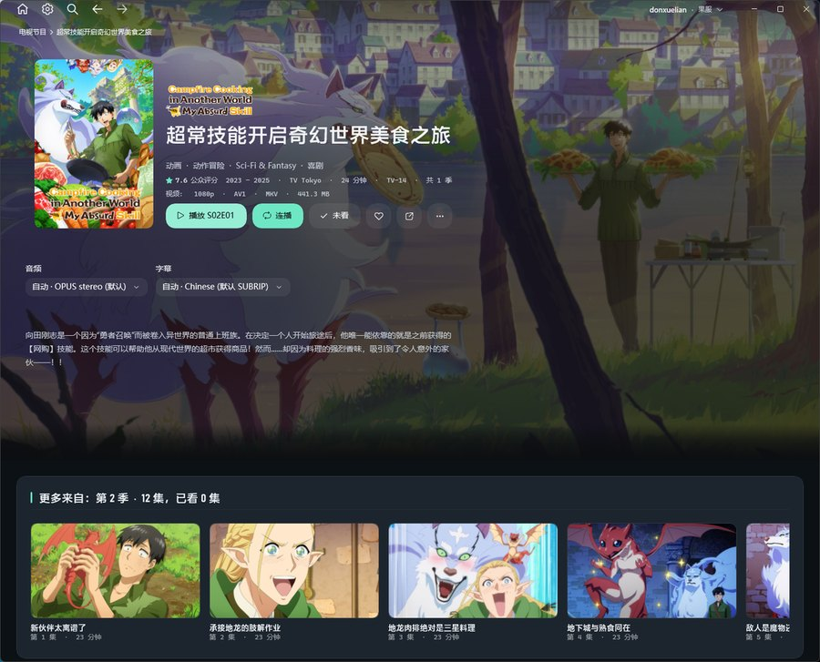
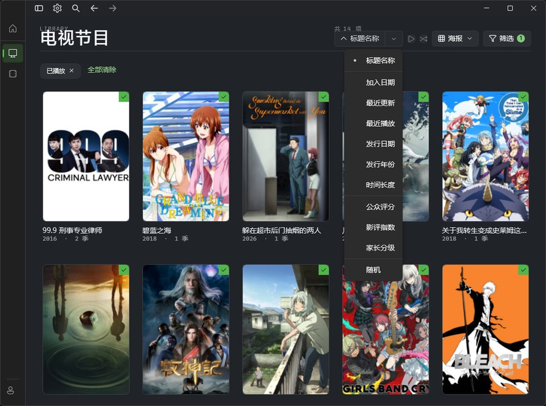
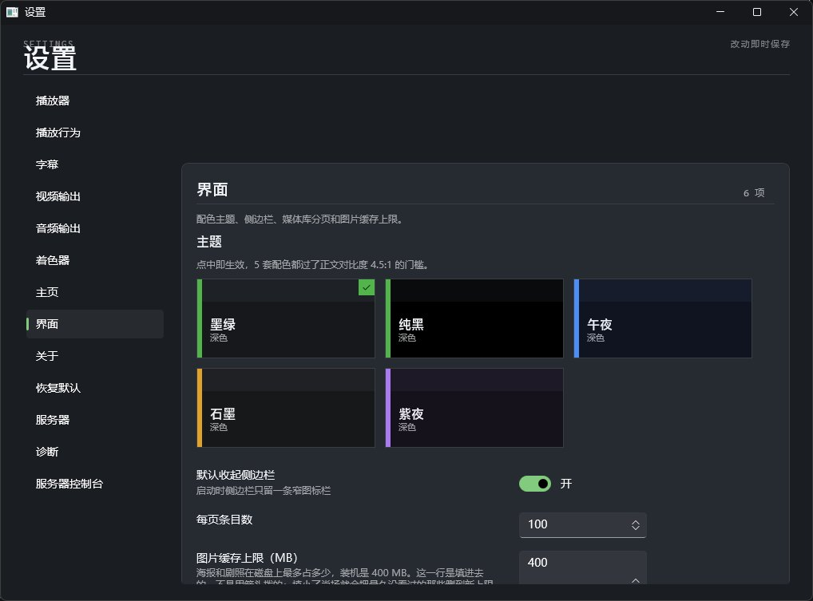
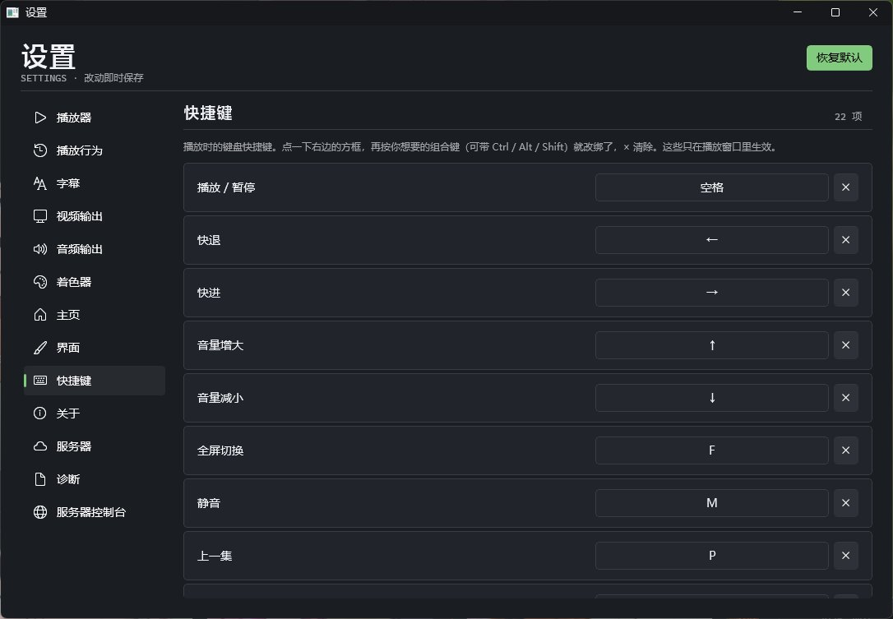

# EmbyNian

telegram 发布频道：https://t.me/EmbyNian

一个 Emby 服务器（4.9.x）的 Windows 桌面客户端。不套壳网页，界面是原生 WinUI 3，播放内核是 libmpv。解压即用，没有安装程序，也没有自动更新。

## 主要功能

**播放器** — 内置 libmpv，随程序打包，不用另外装 mpv。进度、音量、字幕、音轨、章节、倍速、全屏、窗口置顶都在播放器里直接调。自动跳过片头片尾，自动连播下一集（跨季也接），断点续播。

**画质** — 着色器随程序打包（ArtCNN、ravu、CfL、SSimDownscaler 等），按放大倍数分四档 × 真人/动画 × 显卡档，每一档都做色度重建。自动按 Emby 的类型和标签识别动画片；DVD 那一代的老片源自动加去色带和降噪；超过 30 fps 自动让出 CNN 放大器保帧率。

**字幕** — 语言优先级可排（越靠前越优先，支持兜底）；字体、字号、缩放、加粗、颜色、描边、阴影、底板全部可调，改完立刻作用到正在播的片子，旁边有实时预览。图形字幕可以拉伸到画面里。

**浏览** — 主页顶部是轮播大图，下面几排可以拖动排序、取消勾选就不显示，每排的标题能点进对应的媒体库。媒体库支持排序和筛选。详情页带简介、演员和媒体信息。收藏、已看、改元数据、换封面、下载到设备都能在客户端里做。

**界面** — 五套深色配色（墨绿、纯黑、午夜、石墨、紫夜），点一下立即生效。窗口拉窄时版式自己换成紧凑布局。支持键盘、鼠标、触摸。

## 快捷键

播放时：

| 按键 | 作用 |
| --- | --- |
| 空格 / `←` `→` / `↑` `↓` | 播放暂停 / 快退快进 / 音量 ±5 |
| `F` / `Esc` / `M` / `T` | 全屏 / 退出 / 静音 / 窗口置顶 |
| `P` / `N` | 上一集 / 下一集（跨季） |
| `PageUp` / `PageDown` | 上一章节 / 下一章节 |
| `[` `]` / `Backspace` | 倍速 ±0.1 / 回到 1.0 |
| `Z` / `X`（加 `Shift` 反向） | 字幕 / 音频延迟 ±0.1 秒 |
| `Y` | 确认跳过片头 / 片尾 |

以上都能在 **设置 → 快捷键** 里改绑（支持 `Ctrl` / `Alt` / `Shift` 组合键，只在播放窗口内生效）；`Esc` 和 `Y` 固定不可改。

## 如何使用

### 系统要求

- Windows 10 1809 及以上，仅 x64
- 服务器：Emby 4.9.x
- 可选：「服务器控制台」页需要 WebView2 Runtime，没有则提示改用浏览器打开

### 下载

到 [Releases](https://github.com/cudamin/EmbyNian/releases) 下载最新的 `EmbyNian_windows-x64_x.x.x.exe` 安装包。

### 第一次使用

1. 打开程序，在登录页填 Emby 服务器的地址、用户名和密码。
2. 地址可以只填 `主机:端口`（比如 `192.168.31.230:8896`），程序会自己补上协议；局域网里也能自动发现服务器。
3. 登录后回到主页，点封面进详情页，点播放开始看。

账号密码存在本地，用 Windows 的 DPAPI 加密，只有当前用户能解开。

### 常用设置

- **播放器**：用内置播放器还是外部 `mpv.exe`
- **播放行为**：断点续播、自动连播、开始播放后自动全屏、独立窗口播放、片头片尾
- **字幕**：语言优先级和字幕外观
- **视频输出 / 音频输出**：渲染方式、硬件解码、输出设备、独占模式、功放直通
- **画质与着色器**：画质预设、着色器开关、显卡档位、老片源修复
- **主页**：轮播图的来源与张数、主页那几排的次序和显示与否
- **界面**：配色主题、分页条数、图片缓存上限
- **快捷键 / 服务器 / 诊断 / 服务器控制台**

改动即时保存。设置文件、日志和图片缓存都在 `%LOCALAPPDATA%\EmbyNian`。

## 说明

这是一个个人自用的客户端，纯 AI 开发。播放内核用到的着色器、`vulkan-1.dll` 和 `libmpv-2.dll` 都已随发布包一起打包，**安装完开箱即用，不需要另外装 mpv 或其它东西**。

只有从源码构建时才需要自己准备：`libmpv-2.dll` 有 117 MB，为避免把仓库撑大，它没有入库，构建前要放到仓库根目录（缺失时构建照常通过，只是播放时报找不到内核）。

架构、构建、发布和自检的细节见 [docs/开发与验证.md](docs/开发与验证.md)。
